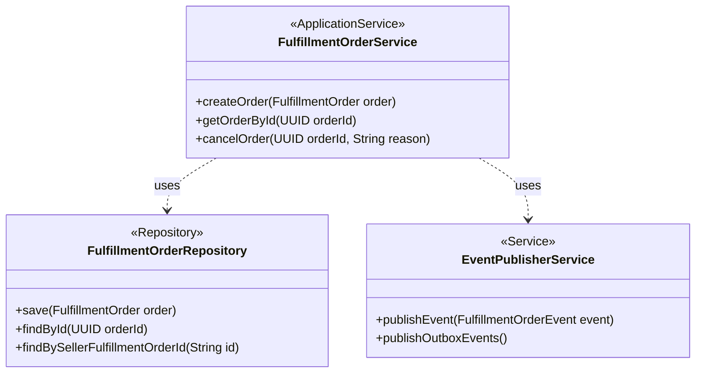

# Application Services and Repository

This diagram shows the `FulfillmentOrderService` application service and its dependencies on the `FulfillmentOrderRepository` interface and the `EventPublisherService`.

- **`FulfillmentOrderService`**: Application Service for orchestrating order-related use cases.
- **`FulfillmentOrderRepository`**: Domain Repository interface for persistence.
- **`EventPublisherService`**: Application/Infrastructure service for publishing domain events.

