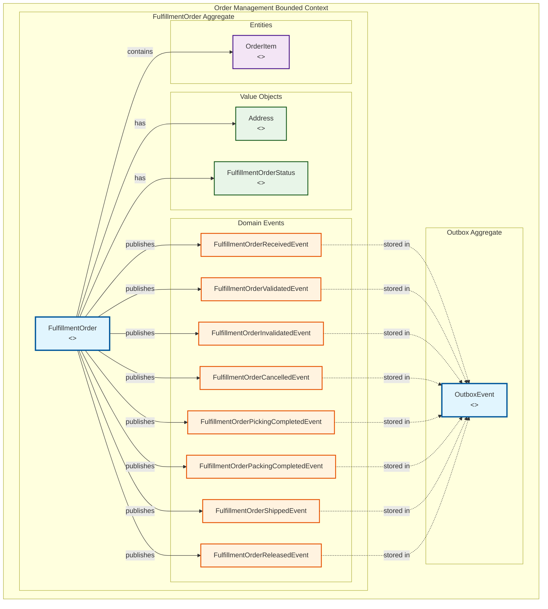
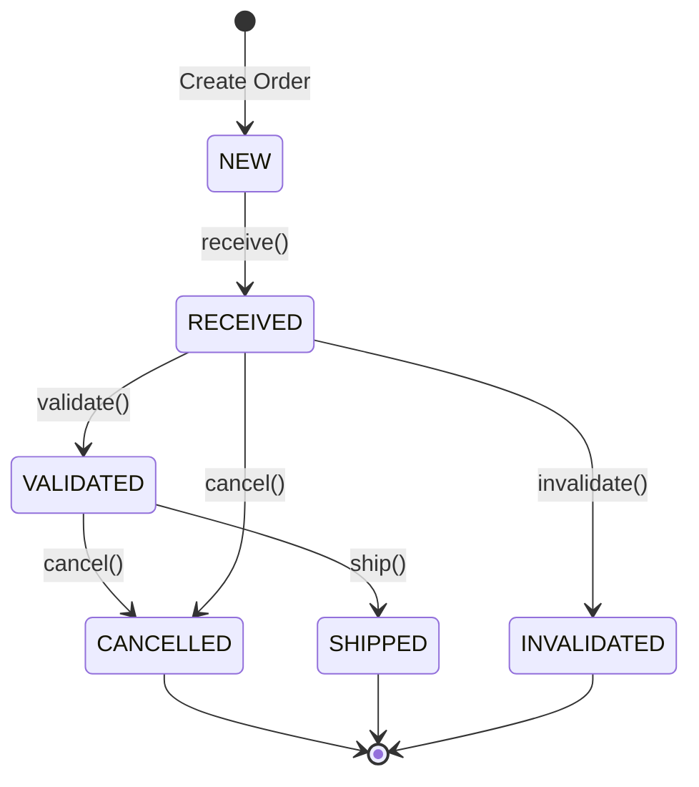

# Order Management - Aggregates Diagram

This diagram shows the main aggregates in the Order Management bounded context, their relationships, and key behaviors.

## Aggregate Details

### FulfillmentOrder Aggregate
**Aggregate Root**: `FulfillmentOrder`
- **Purpose**: Manages the complete lifecycle of a fulfillment order
- **Invariants**:
  - Cannot cancel shipped orders
  - Must have at least one order item
  - Unique sellerFulfillmentOrderId per seller
- **Key Behaviors**:
  - `receive()`: Transition from NEW to RECEIVED
  - `validate()`: Transition from RECEIVED to VALIDATED
  - `invalidate()`: Transition from RECEIVED to INVALIDATED
  - `cancel()`: Transition to CANCELLED (if not shipped)

### OutboxEvent Aggregate
**Aggregate Root**: `OutboxEvent`
- **Purpose**: Implements transactional outbox pattern for reliable event publishing
- **Invariants**:
  - Events are immutable once created
  - Published flag ensures idempotency
- **Key Behaviors**:
  - Store domain events transactionally
  - Track publication status
  - Enable retry mechanism

## State Transitions

## Business Rules

1. **Order Uniqueness**: Each `sellerFulfillmentOrderId` must be unique per seller
2. **State Validation**: Orders can only transition through valid state paths
3. **Cancellation Rules**: Orders cannot be cancelled once shipped
4. **Event Publishing**: All state changes must publish corresponding domain events
5. **Transactional Consistency**: Order state and events must be updated atomically