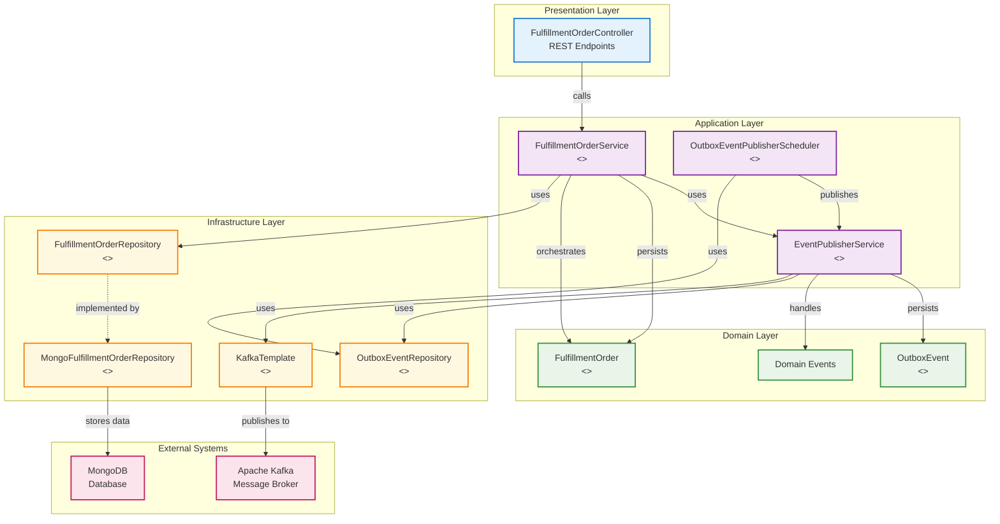
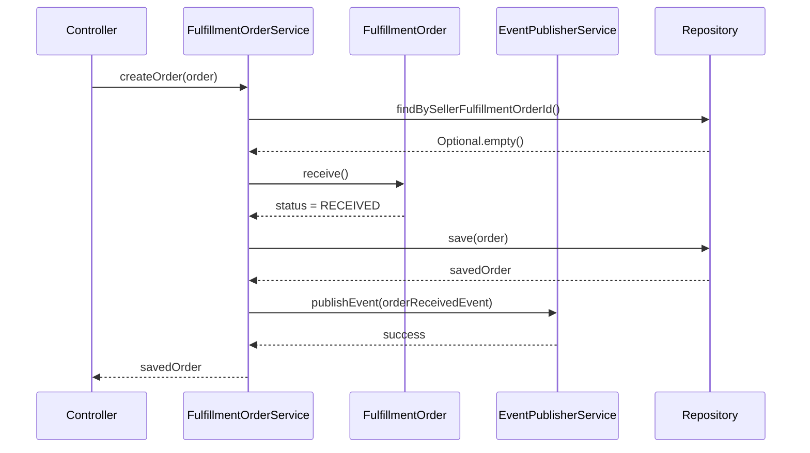
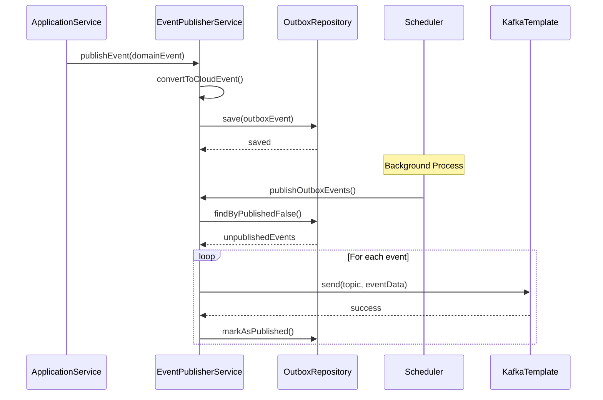
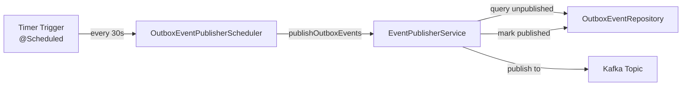
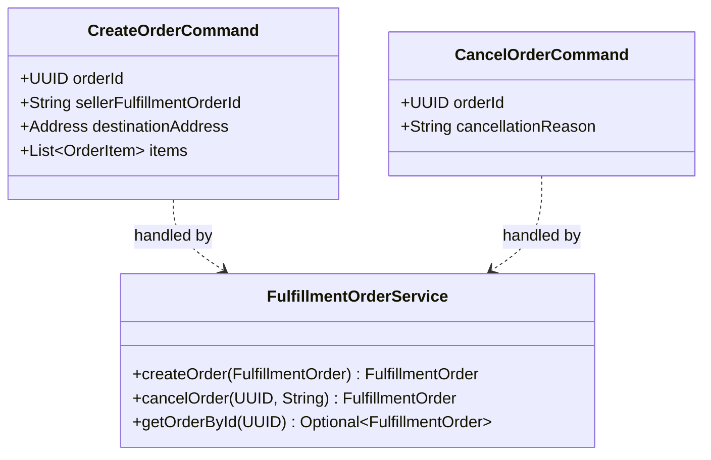
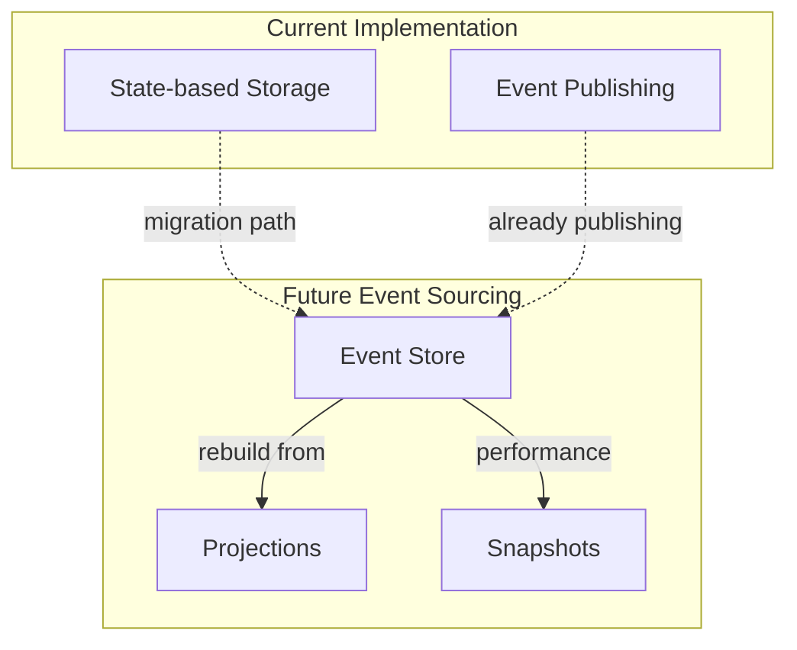
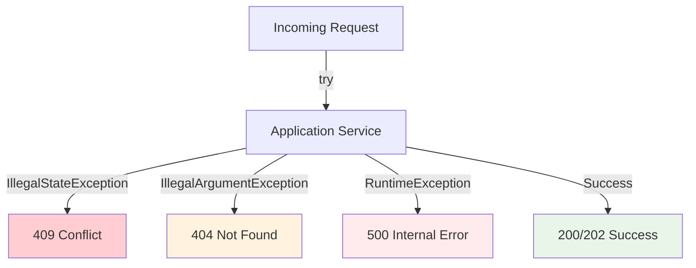
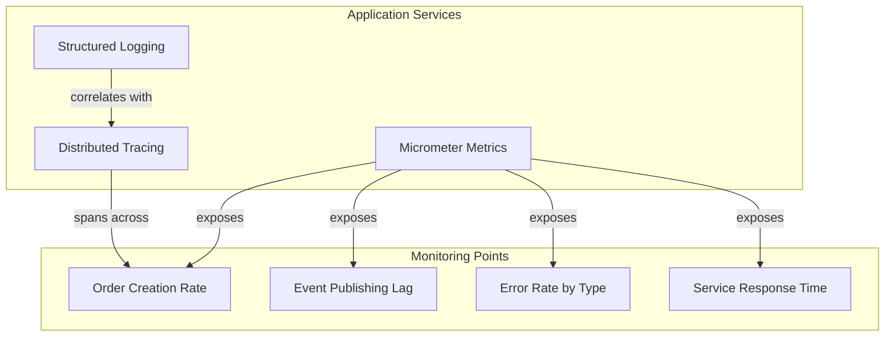
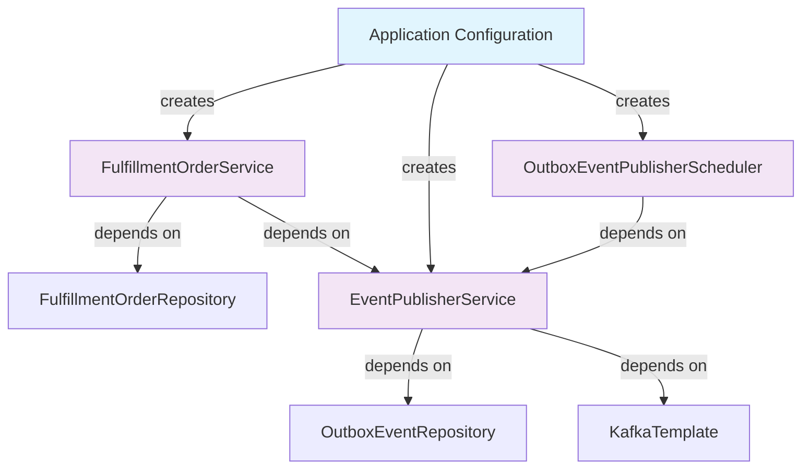

# Order Management - Application Services Diagram

This diagram shows the application layer services, their responsibilities, and interactions with the domain and infrastructure layers.



## Application Services Details

### FulfillmentOrderService
**Purpose**: Orchestrates fulfillment order business operations


**Key Responsibilities**:
- Order creation with uniqueness validation
- Order retrieval by ID
- Order cancellation with business rule validation
- Transaction boundary management
- Event publishing coordination

### EventPublisherService
**Purpose**: Handles domain event publishing using transactional outbox pattern


**Key Responsibilities**:
- CloudEvents format conversion
- Transactional outbox pattern implementation
- Retry mechanism for failed publications
- At-least-once delivery guarantee

### OutboxEventPublisherScheduler
**Purpose**: Background scheduler for reliable event delivery


**Key Responsibilities**:
- Periodic execution of event publishing
- Error handling and logging
- Monitoring unpublished events
- Dead letter queue handling (future enhancement)

## Service Interaction Patterns

### Command Pattern


### Event Sourcing Support (Future)


## Cross-Cutting Concerns

### Transaction Management
```mermaid
graph LR
    subgraph "Transaction Boundary"
        TXN[@Transactional]
        ORDER[Order State Change]
        EVENT[Event Storage]
    end

    TXN -->|ensures| ORDER
    TXN -->|ensures| EVENT
    TXN -->|rollback on failure| ORDER
    TXN -->|rollback on failure| EVENT
```

### Error Handling


### Monitoring and Observability


## Configuration and Dependencies

### Spring Configuration
```java
@Configuration
@EnableTransactionManagement
@EnableScheduling
public class ApplicationConfig {

    @Bean
    public FulfillmentOrderService fulfillmentOrderService(
            FulfillmentOrderRepository repository,
            EventPublisherService eventPublisher) {
        return new FulfillmentOrderService(repository, eventPublisher);
    }

    @Bean
    public EventPublisherService eventPublisherService(
            OutboxEventRepository outboxRepository,
            KafkaTemplate<String, String> kafkaTemplate,
            ObjectMapper objectMapper) {
        return new EventPublisherService(outboxRepository, kafkaTemplate, objectMapper);
    }
}
```

### Dependency Injection Flow
