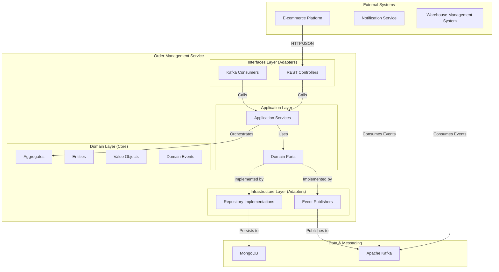
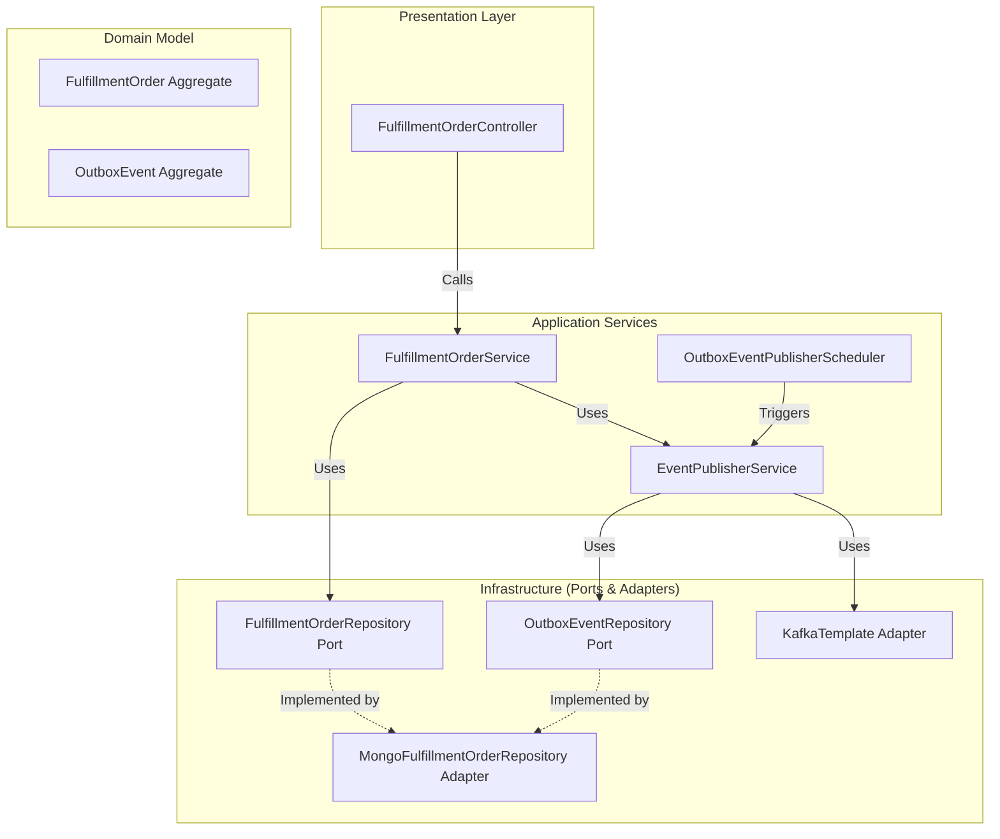
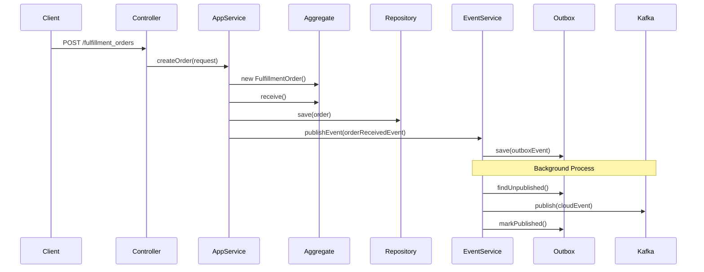

# Order Management Service - Architecture

This document provides a comprehensive overview of the Order Management Service architecture, following the Hexagonal Architecture (Ports and Adapters) pattern.

## 1. High-Level System Architecture

This diagram shows the overall structure of the service and its interactions with external systems.

## 2. Application Services and Interactions

This section details the application services and how they interact with other layers.

### FulfillmentOrderService
- **Responsibility:** Orchestrates the lifecycle of fulfillment orders.
- **Key Operations:** Creating, validating, and canceling orders.
- **Dependencies:** `FulfillmentOrderRepository`, `EventPublisherService`.

### EventPublisherService
- **Responsibility:** Publishes domain events using the transactional outbox pattern.
- **Key Operations:** Saving events to the outbox, publishing events to Kafka.
- **Dependencies:** `OutboxEventRepository`, `KafkaTemplate`.

### OutboxEventPublisherScheduler
- **Responsibility:** Periodically triggers the `EventPublisherService` to send unpublished events.
- **Key Operations:** Runs on a schedule to ensure reliable event delivery.
- **Dependencies:** `EventPublisherService`.

## 3. Data Flow: Order Creation

This sequence diagram illustrates the process of creating a new fulfillment order.

## 4. Technology Stack

- **Language:** Java 17
- **Framework:** Spring Boot
- **Database:** MongoDB
- **Messaging:** Apache Kafka
- **Build:** Maven
