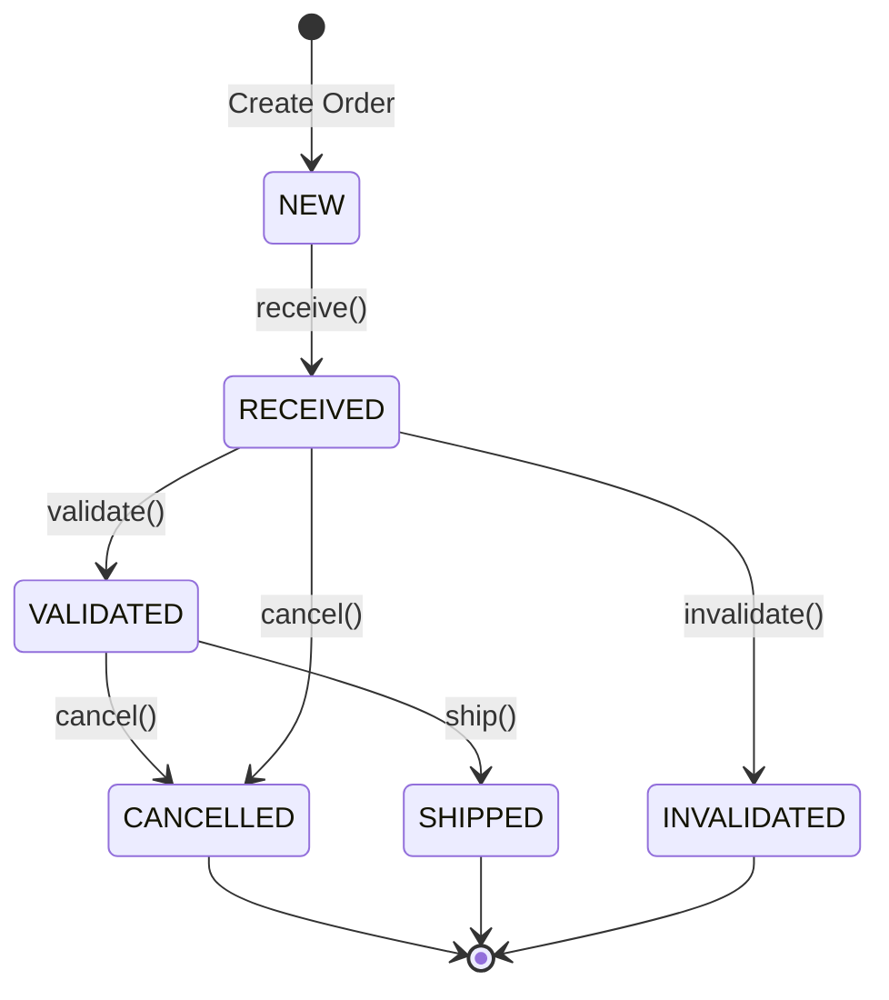

# Domain-Driven Design Components

This document details the aggregates, entities, and value objects that make up the domain model of the Order Management Service.

## 1. FulfillmentOrder Aggregate

This is the central aggregate of the domain, representing a fulfillment order.

- **Aggregate Root:** `FulfillmentOrder`

### Entities

#### `OrderItem`
- **Purpose:** Represents a single item within a fulfillment order.
- **Identity:** `sellerFulfillmentOrderItemId`
- **Properties:**
    - `sellerSku: String`
    - `sellerFulfillmentOrderItemId: String`
    - `quantity: Integer`
    - `giftMessage: String`
    - `displayableComment: String`

### Value Objects

#### `Address`
- **Purpose:** Represents a postal address.
- **Characteristics:** Immutable (in principle), no identity.
- **Properties:**
    - `name: String`
    - `addressLine1: String`
    - `addressLine2: String`
    - `city: String`
    - `stateOrRegion: String`
    - `postalCode: String`
    - `countryCode: String`

#### `FulfillmentOrderStatus`
- **Purpose:** Represents the lifecycle status of an order.
- **Type:** Enum
- **Values:** `NEW`, `RECEIVED`, `VALIDATED`, `INVALIDATED`, `CANCELLED`, `SHIPPED`

### `FulfillmentOrder` Aggregate Root Details

- **Properties:**
    - `orderId: UUID` (Primary Identifier)
    - `sellerFulfillmentOrderId: String`
    - `displayableOrderId: String`
    - `displayableOrderDate: LocalDateTime`
    - `displayableOrderComment: String`
    - `shippingSpeedCategory: String`
    - `destinationAddress: Address` (Value Object)
    - `status: FulfillmentOrderStatus` (Value Object)
    - `items: List<OrderItem>` (Entities)
    - `receivedDate: LocalDateTime`
    - `cancellationReason: String`

- **Business Methods (State Transitions):**
    - `receive()`: Changes status from `NEW` to `RECEIVED`.
    - `validate()`: Changes status from `RECEIVED` to `VALIDATED`.
    - `invalidate(String reason)`: Changes status from `RECEIVED` to `INVALIDATED`.
    - `cancel(String reason)`: Changes status to `CANCELLED` if not already shipped.

### State Transition Diagram

## 2. OutboxEvent Aggregate

This aggregate ensures reliable event publishing using the transactional outbox pattern.

- **Aggregate Root:** `OutboxEvent`
- **Purpose:** To store domain events in the same transaction as the business operation, to be published later by a background process.

### `OutboxEvent` Aggregate Root Details

- **Properties:**
    - `id: String` (Primary Identifier)
    - `eventType: String`
    - `eventData: String` (Serialized event payload)
    - `createdAt: LocalDateTime`
    - `published: boolean`
