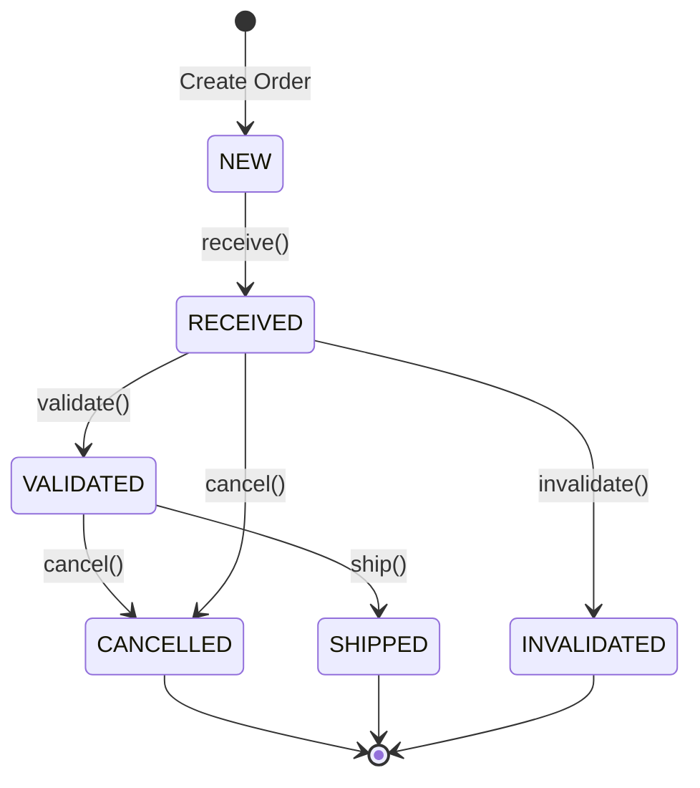

# Order Management Service - Developer Guide

## 1. OVERVIEW

### Purpose and Primary Functionality

The Order Management Service is a domain-driven microservice responsible for managing the complete lifecycle of fulfillment orders within the Paklog ecosystem. It provides capabilities for:

- **Order Creation**: Accepting and validating new fulfillment orders from external systems
- **Order State Management**: Tracking orders through their lifecycle (NEW → RECEIVED → VALIDATED/INVALIDATED → CANCELLED/SHIPPED)
- **Event-Driven Communication**: Publishing domain events using CloudEvents standard to enable choreographed workflows
- **Transactional Outbox Pattern**: Ensuring reliable event delivery through the outbox pattern

### When to Use This Component vs. Alternatives

**Use the Order Management Service when:**
- You need to create, retrieve, or cancel fulfillment orders
- You require guaranteed event delivery for order state changes
- You need to integrate with warehouse management systems for order fulfillment
- You're building event-driven choreography patterns around order processing

**Consider alternatives when:**
- Building simple CRUD operations without business logic (use a generic data service)
- Managing different types of orders (e.g., purchase orders, return orders) - these should have their own bounded contexts
- Handling order payment processing (use a dedicated payment service)

### Architectural Context

The service fits within a larger microservices ecosystem as the **Order Management Bounded Context**:

```
┌─────────────────┐    ┌─────────────────┐    ┌─────────────────┐
│   E-commerce    │───▶│ Order Management│───▶│   Warehouse     │
│    Platform     │    │    Service      │    │   Management    │
└─────────────────┘    └─────────────────┘    └─────────────────┘
                              │
                              ▼
                       ┌─────────────────┐
                       │ Kafka Events    │
                       │ (CloudEvents)   │
                       └─────────────────┘
```

## 2. TECHNICAL SPECIFICATION

### Core Domain Model

#### FulfillmentOrder Entity
**Location**: `src/main/java/com/paklog/ordermanagement/domain/model/FulfillmentOrder.java:11`

| Property | Type | Description |
|----------|------|-------------|
| `orderId` | `UUID` | System-generated unique identifier |
| `sellerFulfillmentOrderId` | `String` | External seller's order identifier |
| `displayableOrderId` | `String` | Human-readable order identifier |
| `displayableOrderDate` | `LocalDateTime` | Order date for display purposes |
| `displayableOrderComment` | `String` | Optional order comment |
| `shippingSpeedCategory` | `String` | Shipping speed requirement |
| `destinationAddress` | `Address` | Delivery address |
| `status` | `FulfillmentOrderStatus` | Current order status |
| `items` | `List<OrderItem>` | Order line items |
| `receivedDate` | `LocalDateTime` | When order was received |
| `cancellationReason` | `String` | Reason for cancellation (if applicable) |

#### FulfillmentOrderStatus Enum
**Location**: `src/main/java/com/paklog/ordermanagement/domain/model/FulfillmentOrderStatus.java:3`

| Status | Description |
|--------|-------------|
| `NEW` | Initial state when order is created |
| `RECEIVED` | Order has been accepted by the system |
| `VALIDATED` | Order has passed business rule validation |
| `INVALIDATED` | Order failed business rule validation |
| `CANCELLED` | Order has been cancelled |
| `SHIPPED` | Order has been shipped (terminal state) |

### API Reference

#### REST Endpoints

**Base URL**: `/fulfillment_orders`

##### Create Fulfillment Order
```http
POST /fulfillment_orders
Content-Type: application/json

{
  "sellerFulfillmentOrderId": "string",
  "displayableOrderId": "string",
  "displayableOrderDate": "2024-01-01T10:00:00",
  "displayableOrderComment": "string",
  "shippingSpeedCategory": "STANDARD",
  "destinationAddress": {
    "name": "John Doe",
    "line1": "123 Main St",
    "city": "Springfield",
    "stateOrRegion": "IL",
    "postalCode": "62701",
    "countryCode": "US"
  },
  "items": [
    {
      "sellerSku": "SKU-123",
      "quantity": 2,
      "sellerFulfillmentOrderItemId": "item-1"
    }
  ]
}
```

**Responses**:
- `202 Accepted`: Order created successfully
- `409 Conflict`: Order with same `sellerFulfillmentOrderId` already exists
- `400 Bad Request`: Invalid request data

##### Get Fulfillment Order
```http
GET /fulfillment_orders/{orderId}
```

**Parameters**:
- `orderId` (path): UUID of the order

**Responses**:
- `200 OK`: Returns order details
- `404 Not Found`: Order does not exist

##### Cancel Fulfillment Order
```http
POST /fulfillment_orders/{orderId}/cancel
Content-Type: application/json

{
  "cancellationReason": "Customer requested cancellation"
}
```

**Responses**:
- `202 Accepted`: Cancellation accepted
- `400 Bad Request`: Cancellation not allowed (e.g., already shipped)
- `404 Not Found`: Order does not exist

### Application Services

#### FulfillmentOrderService
**Location**: `src/main/java/com/paklog/ordermanagement/application/service/FulfillmentOrderService.java:15`

**Core Methods**:

| Method | Parameters | Return Type | Description |
|--------|------------|-------------|-------------|
| `createOrder()` | `FulfillmentOrder` | `FulfillmentOrder` | Creates and processes new order |
| `getOrderById()` | `UUID` | `Optional<FulfillmentOrder>` | Retrieves order by ID |
| `cancelOrder()` | `UUID, String` | `FulfillmentOrder` | Cancels order with reason |

### Event System

#### Domain Events Published

All events follow CloudEvents specification and are published to Kafka topic: `fulfillment.order_management.v1.events`

| Event Type | Trigger | Data Included |
|------------|---------|---------------|
| `com.example.fulfillment.order.received` | Order successfully created | Complete order details |
| `com.example.fulfillment.order.validated` | Order passes validation | Order ID, validation details |
| `com.example.fulfillment.order.invalidated` | Order fails validation | Order ID, validation errors |
| `com.example.fulfillment.order.cancelled` | Order cancelled | Order ID, cancellation reason |

#### Event Publisher Service
**Location**: `src/main/java/com/paklog/ordermanagement/application/service/EventPublisherService.java:20`

**Key Features**:
- **Transactional Outbox Pattern**: Events are first saved to outbox table, then published
- **CloudEvents Format**: All events follow CloudEvents v1.0 specification
- **Retry Mechanism**: Failed events are retried by background scheduler
- **At-Least-Once Delivery**: Guaranteed delivery with idempotency handled by consumers

### State Management

#### Order State Transitions



**Business Rules**:
- Orders can only be cancelled if not yet shipped
- Validation can only occur on received orders
- Once shipped, orders cannot be modified

### Infrastructure

#### Database (MongoDB)
- **Collection**: `fulfillment_orders`
- **Outbox Collection**: `outbox_events`
- **Indexes**: Recommended on `sellerFulfillmentOrderId` for uniqueness checks

#### Messaging (Kafka)
- **Topic**: `fulfillment.order_management.v1.events`
- **Partitioning**: By order ID for ordering guarantees
- **Serialization**: CloudEvents JSON format

## 3. IMPLEMENTATION EXAMPLES

### Basic Usage Example

```java
@RestController
public class OrderIntegrationController {

    @Autowired
    private FulfillmentOrderService orderService;

    @PostMapping("/orders")
    public ResponseEntity<String> createOrder(@RequestBody CreateOrderRequest request) {
        // Convert request to domain model
        FulfillmentOrder order = new FulfillmentOrder(
            UUID.randomUUID(),
            request.getSellerOrderId(),
            request.getDisplayableOrderId(),
            request.getOrderDate(),
            request.getComment(),
            "STANDARD",
            request.getAddress(),
            request.getItems()
        );

        try {
            FulfillmentOrder created = orderService.createOrder(order);
            return ResponseEntity.accepted()
                .body("Order created with ID: " + created.getOrderId());
        } catch (IllegalStateException e) {
            return ResponseEntity.status(409)
                .body("Order already exists");
        }
    }
}
```

### Advanced Configuration Example

```java
@Configuration
public class OrderManagementConfig {

    @Bean
    @Primary
    public KafkaTemplate<String, String> kafkaTemplate() {
        Map<String, Object> props = new HashMap<>();
        props.put(ProducerConfig.BOOTSTRAP_SERVERS_CONFIG, "localhost:9092");
        props.put(ProducerConfig.KEY_SERIALIZER_CLASS_CONFIG, StringSerializer.class);
        props.put(ProducerConfig.VALUE_SERIALIZER_CLASS_CONFIG, StringSerializer.class);

        // Enable idempotence for exactly-once semantics
        props.put(ProducerConfig.ENABLE_IDEMPOTENCE_CONFIG, true);
        props.put(ProducerConfig.ACKS_CONFIG, "all");
        props.put(ProducerConfig.RETRIES_CONFIG, Integer.MAX_VALUE);

        return new KafkaTemplate<>(new DefaultKafkaProducerFactory<>(props));
    }

    @Bean
    public MongoTransactionManager transactionManager(MongoDatabaseFactory factory) {
        return new MongoTransactionManager(factory);
    }
}
```

### Event Consumer Example

```java
@Component
public class OrderEventConsumer {

    @KafkaListener(topics = "fulfillment.order_management.v1.events")
    public void handleOrderEvent(String cloudEventJson) {
        try {
            JsonFormat jsonFormat = new JsonFormat();
            CloudEvent event = jsonFormat.deserialize(cloudEventJson.getBytes());

            switch (event.getType()) {
                case "com.example.fulfillment.order.received":
                    handleOrderReceived(event);
                    break;
                case "com.example.fulfillment.order.cancelled":
                    handleOrderCancelled(event);
                    break;
            }
        } catch (Exception e) {
            log.error("Failed to process event", e);
        }
    }

    private void handleOrderReceived(CloudEvent event) {
        // Extract order data and process
        String orderData = new String(event.getData().toBytes());
        // Process order received event
    }
}
```

### Custom Validation Example

```java
@Component
public class OrderValidationService {

    public void validateOrder(FulfillmentOrder order) {
        List<String> errors = new ArrayList<>();

        // Validate address
        if (order.getDestinationAddress() == null) {
            errors.add("Destination address is required");
        }

        // Validate items
        if (order.getItems().isEmpty()) {
            errors.add("Order must contain at least one item");
        }

        // Check inventory
        for (OrderItem item : order.getItems()) {
            if (!inventoryService.isAvailable(item.getSellerSku(), item.getQuantity())) {
                errors.add("Insufficient inventory for SKU: " + item.getSellerSku());
            }
        }

        if (!errors.isEmpty()) {
            order.invalidate(String.join(", ", errors));
            throw new ValidationException("Order validation failed: " + errors);
        } else {
            order.validate();
        }
    }
}
```

### Testing Patterns

```java
@DataMongoTest
public class FulfillmentOrderRepositoryTest {

    @Autowired
    private TestEntityManager entityManager;

    @Autowired
    private FulfillmentOrderRepository repository;

    @Test
    public void shouldFindBySellerFulfillmentOrderId() {
        // Given
        FulfillmentOrder order = createTestOrder();
        entityManager.persistAndFlush(order);

        // When
        Optional<FulfillmentOrder> found = repository
            .findBySellerFulfillmentOrderId(order.getSellerFulfillmentOrderId());

        // Then
        assertThat(found).isPresent();
        assertThat(found.get().getSellerFulfillmentOrderId())
            .isEqualTo(order.getSellerFulfillmentOrderId());
    }
}

@SpringBootTest
@TestPropertySource(properties = {
    "spring.kafka.bootstrap-servers=${spring.embedded.kafka.brokers}"
})
public class OrderEventIntegrationTest {

    @Test
    public void shouldPublishEventWhenOrderCreated() {
        // Test event publishing with embedded Kafka
    }
}
```

## 4. TROUBLESHOOTING

### Common Errors and Solutions

#### Error: "Order with sellerFulfillmentOrderId already exists"
**Cause**: Attempting to create order with duplicate `sellerFulfillmentOrderId`
**Solution**: Check for existing orders before creation, or implement idempotency keys

```java
@PostMapping("/orders")
public ResponseEntity<?> createOrder(@RequestBody CreateOrderRequest request) {
    try {
        FulfillmentOrder order = convertToOrder(request);
        FulfillmentOrder created = orderService.createOrder(order);
        return ResponseEntity.accepted().body(created);
    } catch (IllegalStateException e) {
        // Check if this is a duplicate order scenario
        Optional<FulfillmentOrder> existing = orderService
            .findBySellerOrderId(request.getSellerFulfillmentOrderId());
        if (existing.isPresent()) {
            return ResponseEntity.ok(existing.get()); // Return existing order
        }
        return ResponseEntity.status(409).body("Conflict: " + e.getMessage());
    }
}
```

#### Error: "Cannot cancel an order that has already been shipped"
**Cause**: Attempting to cancel order in SHIPPED status
**Solution**: Check order status before cancellation

```java
public void cancelOrderSafely(UUID orderId, String reason) {
    FulfillmentOrder order = orderService.getOrderById(orderId)
        .orElseThrow(() -> new OrderNotFoundException(orderId));

    if (order.getStatus() == FulfillmentOrderStatus.SHIPPED) {
        throw new BusinessException(
            "Order " + orderId + " cannot be cancelled as it has been shipped"
        );
    }

    orderService.cancelOrder(orderId, reason);
}
```

#### Error: "Failed to publish event"
**Cause**: Kafka connectivity issues or serialization problems
**Solution**:
1. Check Kafka broker connectivity
2. Verify CloudEvents serialization
3. Monitor outbox events for failed publications

```java
@Component
public class EventHealthChecker {

    @Autowired
    private OutboxEventRepository outboxRepository;

    @Scheduled(fixedDelay = 60000) // Check every minute
    public void checkUnpublishedEvents() {
        List<OutboxEvent> oldEvents = outboxRepository
            .findByPublishedFalseAndCreatedDateBefore(
                LocalDateTime.now().minusMinutes(5)
            );

        if (!oldEvents.isEmpty()) {
            log.warn("Found {} unpublished events older than 5 minutes",
                oldEvents.size());
            // Alert or retry logic
        }
    }
}
```

### Debugging Strategies

#### Enable Debug Logging
Add to `application.yml`:
```yaml
logging:
  level:
    com.paklog.ordermanagement: DEBUG
    org.springframework.kafka: DEBUG
    org.springframework.data.mongodb: DEBUG
```

#### Monitor Key Metrics
- Order creation rate
- Event publication lag
- Failed validation count
- Cancellation rate by reason

#### Database Query Optimization
```java
// Add indexes for common queries
@Document(collection = "fulfillment_orders")
@CompoundIndex(def = "{'sellerFulfillmentOrderId': 1}", unique = true)
@CompoundIndex(def = "{'status': 1, 'receivedDate': -1}")
public class FulfillmentOrder {
    // ...
}
```

### Performance Considerations

#### Database Performance
- **Connection Pooling**: Configure appropriate MongoDB connection pool size
- **Indexes**: Ensure indexes on `sellerFulfillmentOrderId` and `status` fields
- **Batch Operations**: Use bulk operations for processing multiple orders

#### Event Publishing Performance
- **Batch Publishing**: Publish events in batches during low-traffic periods
- **Async Processing**: Use `@Async` for non-critical event publishing
- **Partitioning**: Partition Kafka topics by order ID for parallel processing

```java
@Configuration
@EnableAsync
public class AsyncConfig {

    @Bean
    public TaskExecutor eventPublishingExecutor() {
        ThreadPoolTaskExecutor executor = new ThreadPoolTaskExecutor();
        executor.setCorePoolSize(5);
        executor.setMaxPoolSize(10);
        executor.setQueueCapacity(100);
        executor.setThreadNamePrefix("event-publisher-");
        executor.initialize();
        return executor;
    }
}

@Service
public class AsyncEventPublisher {

    @Async("eventPublishingExecutor")
    public CompletableFuture<Void> publishEventAsync(FulfillmentOrderEvent event) {
        eventPublisherService.publishEvent(event);
        return CompletableFuture.completedFuture(null);
    }
}
```

## 5. RELATED COMPONENTS

### Dependencies

#### Required Dependencies
- **Spring Boot Starter Web**: REST API framework
- **Spring Boot Starter Data MongoDB**: Database access layer
- **Spring Kafka**: Event publishing and consumption
- **CloudEvents Java SDK**: Event formatting and serialization

#### Optional Dependencies
- **Spring Boot Starter Actuator**: Health checks and metrics
- **Micrometer**: Application metrics
- **Spring Boot Starter Security**: API authentication/authorization

### Components Commonly Used Alongside

#### Warehouse Management Service
**Integration Point**: Consumes order events for fulfillment processing
**Event Flow**:
```
Order Management → OrderReceived Event → Warehouse Management
Warehouse Management → ItemPicked Event → Order Management
```

#### Inventory Service
**Integration Point**: Validates item availability during order creation
**Communication**: Synchronous HTTP calls for real-time validation

#### Notification Service
**Integration Point**: Sends customer notifications based on order events
**Event Flow**:
```
Order Management → OrderCancelled Event → Notification Service → Customer Email
```

#### Payment Service
**Integration Point**: Handles order payment processing
**Communication**: Event-driven coordination for payment holds/releases

### Alternative Approaches

#### When to Consider Alternatives

1. **Simple CRUD Requirements**: Use Spring Data REST for basic operations without business logic
2. **Different Order Types**: Create separate bounded contexts for purchase orders, return orders, etc.
3. **High-Frequency Trading**: Consider CQRS with event sourcing for audit trail requirements
4. **Legacy Integration**: Use ESB or API Gateway for complex transformation requirements

#### Comparison with Alternatives

| Approach | Use Case | Pros | Cons |
|----------|----------|------|------|
| **Current DDD Approach** | Complex business logic | Strong domain modeling, clear boundaries | Higher complexity |
| **CRUD Service** | Simple data operations | Fast development, minimal complexity | No business logic encapsulation |
| **Event Sourcing** | Audit requirements | Complete history, temporal queries | Complexity, eventual consistency |
| **Monolithic Approach** | Single team, simple deployment | Easier debugging, no network latency | Scaling limitations, coupling |

#### Migration Considerations

**From Monolith to Microservice**:
1. Identify order-related bounded context
2. Extract domain model and business rules
3. Implement event-driven communication
4. Gradually migrate data using Strangler Fig pattern

**To Event Sourcing**:
1. Implement event store alongside current database
2. Project events to current read models
3. Gradually shift reads to projections
4. Replace command handling with event appending

---

*This documentation covers the core aspects of the Order Management Service. For API specifications, see `openapi.yaml`. For event schemas, see `asyncapi.yaml`. For deployment instructions, see the main `README.md`.*