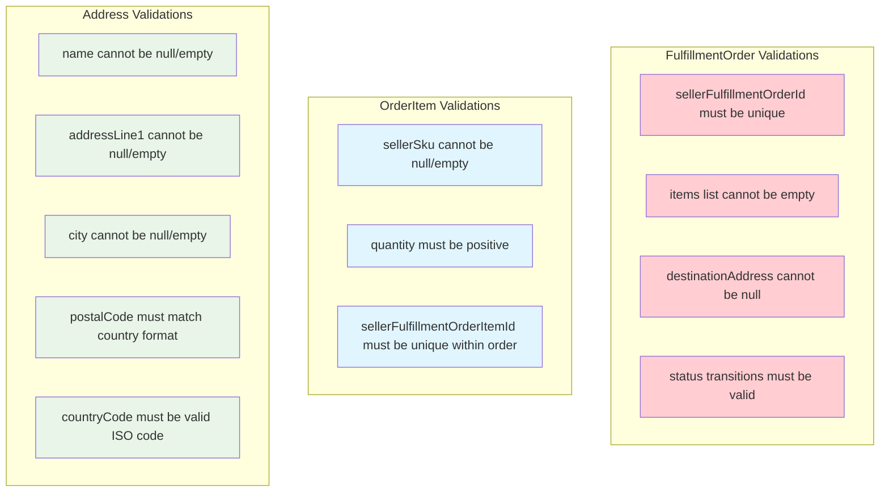

# Order Management - Entities and Value Objects Diagram

This diagram shows the detailed structure of entities and value objects within the Order Management domain.

```mermaid
classDiagram
    class FulfillmentOrder {
        <<Aggregate Root>>
        -UUID orderId
        -String sellerFulfillmentOrderId
        -String displayableOrderId
        -LocalDateTime displayableOrderDate
        -String displayableOrderComment
        -String shippingSpeedCategory
        -Address destinationAddress
        -FulfillmentOrderStatus status
        -List~OrderItem~ items
        -LocalDateTime receivedDate
        -String cancellationReason
        +receive() void
        +validate() void
        +invalidate(String reason) void
        +cancel(String reason) void
    }

    class OrderItem {
        <<Entity>>
        -String sellerSku
        -String sellerFulfillmentOrderItemId
        -Integer quantity
        -String giftMessage
        -String displayableComment
        +equals(Object o) boolean
        +hashCode() int
    }

    class Address {
        <<Value Object>>
        -String name
        -String addressLine1
        -String addressLine2
        -String city
        -String stateOrRegion
        -String postalCode
        -String countryCode
        +equals(Object o) boolean
        +hashCode() int
    }

    class FulfillmentOrderStatus {
        <<Enumeration>>
        NEW
        RECEIVED
        VALIDATED
        INVALIDATED
        CANCELLED
        SHIPPED
    }

    class OutboxEvent {
        <<Aggregate Root>>
        -String id
        -String eventType
        -String eventData
        -LocalDateTime createdAt
        -boolean published
        +setPublished(boolean published) void
    }

    %% Domain Events Base Class
    class FulfillmentOrderEvent {
        <<Abstract>>
        #String id
        #String type
        #String source
        #String subject
        #LocalDateTime time
        #Object data
    }

    class FulfillmentOrderReceivedEvent {
        <<Domain Event>>
        +FulfillmentOrderReceivedEvent(FulfillmentOrder order)
    }

    class FulfillmentOrderValidatedEvent {
        <<Domain Event>>
        +FulfillmentOrderValidatedEvent(FulfillmentOrder order)
    }

    class FulfillmentOrderInvalidatedEvent {
        <<Domain Event>>
        +FulfillmentOrderInvalidatedEvent(FulfillmentOrder order, String reason)
    }

    class FulfillmentOrderCancelledEvent {
        <<Domain Event>>
        +FulfillmentOrderCancelledEvent(String orderId, String sellerOrderId, String reason)
    }

    class FulfillmentOrderPickingCompletedEvent {
        <<Domain Event>>
        +FulfillmentOrderPickingCompletedEvent(FulfillmentOrder order)
    }

    class FulfillmentOrderPackingCompletedEvent {
        <<Domain Event>>
        +FulfillmentOrderPackingCompletedEvent(FulfillmentOrder order)
    }

    class FulfillmentOrderShippedEvent {
        <<Domain Event>>
        +FulfillmentOrderShippedEvent(FulfillmentOrder order)
    }

    class FulfillmentOrderReleasedEvent {
        <<Domain Event>>
        +FulfillmentOrderReleasedEvent(FulfillmentOrder order)
    }

    %% Relationships
    FulfillmentOrder ||--o{ OrderItem : contains
    FulfillmentOrder ||--|| Address : has
    FulfillmentOrder ||--|| FulfillmentOrderStatus : has

    %% Event Inheritance
    FulfillmentOrderEvent <|-- FulfillmentOrderReceivedEvent
    FulfillmentOrderEvent <|-- FulfillmentOrderValidatedEvent
    FulfillmentOrderEvent <|-- FulfillmentOrderInvalidatedEvent
    FulfillmentOrderEvent <|-- FulfillmentOrderCancelledEvent
    FulfillmentOrderEvent <|-- FulfillmentOrderPickingCompletedEvent
    FulfillmentOrderEvent <|-- FulfillmentOrderPackingCompletedEvent
    FulfillmentOrderEvent <|-- FulfillmentOrderShippedEvent
    FulfillmentOrderEvent <|-- FulfillmentOrderReleasedEvent

    %% Event Publishing
    FulfillmentOrder ..> FulfillmentOrderReceivedEvent : publishes
    FulfillmentOrder ..> FulfillmentOrderValidatedEvent : publishes
    FulfillmentOrder ..> FulfillmentOrderInvalidatedEvent : publishes
    FulfillmentOrder ..> FulfillmentOrderCancelledEvent : publishes
    FulfillmentOrder ..> FulfillmentOrderPickingCompletedEvent : publishes
    FulfillmentOrder ..> FulfillmentOrderPackingCompletedEvent : publishes
    FulfillmentOrder ..> FulfillmentOrderShippedEvent : publishes
    FulfillmentOrder ..> FulfillmentOrderReleasedEvent : publishes
```

## Domain Model Characteristics

### Aggregate Roots
- **FulfillmentOrder**: Primary aggregate that maintains consistency boundaries
- **OutboxEvent**: Supporting aggregate for reliable event publishing

### Entities
- **OrderItem**: Has identity through `sellerFulfillmentOrderItemId`
- Belongs to FulfillmentOrder aggregate
- Maintains item-specific information like SKU, quantity, gift messages

### Value Objects
- **Address**: Immutable shipping address information
- **FulfillmentOrderStatus**: Enumeration representing order lifecycle states
- Value objects are compared by value, not identity
- Implement proper `equals()` and `hashCode()` methods

### Domain Events
All domain events follow CloudEvents specification:
- Unique ID for each event
- Standard source identifier
- Timestamp of occurrence
- Event-specific data payload

## Validation Rules



## Immutability and Encapsulation

### Value Objects (Immutable)
- **Address**: Once created, cannot be modified
- **FulfillmentOrderStatus**: Enum values are inherently immutable
- Changes require creating new instances

### Entities (Mutable with Controlled Access)
- **FulfillmentOrder**: State changes only through business methods
- **OrderItem**: Can be modified but only within aggregate boundaries
- **OutboxEvent**: Published flag can change, but event data is immutable

### Business Method Patterns
```java
// State transition with validation
public void receive() {
    if (this.status != FulfillmentOrderStatus.NEW) {
        throw new IllegalStateException("Order must be in NEW status to be received");
    }
    this.status = FulfillmentOrderStatus.RECEIVED;
    this.receivedDate = LocalDateTime.now();
}

// Value object replacement
public void updateAddress(Address newAddress) {
    this.destinationAddress = newAddress; // Replace entire value object
}
```