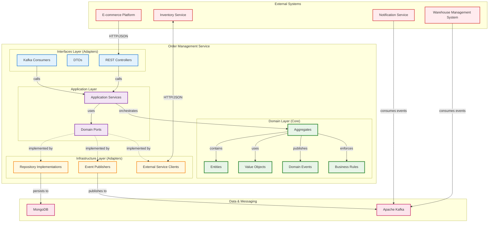
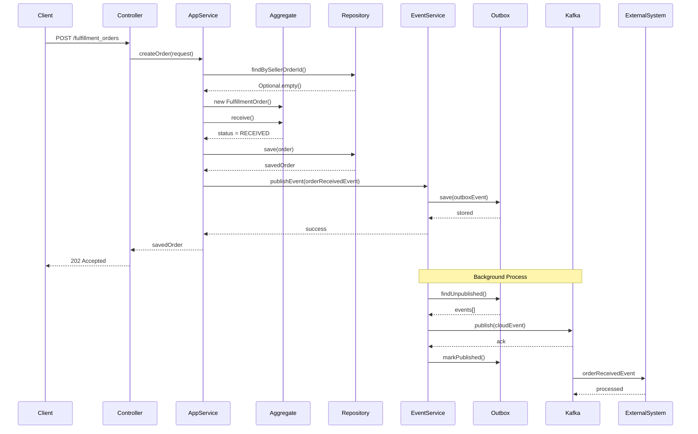
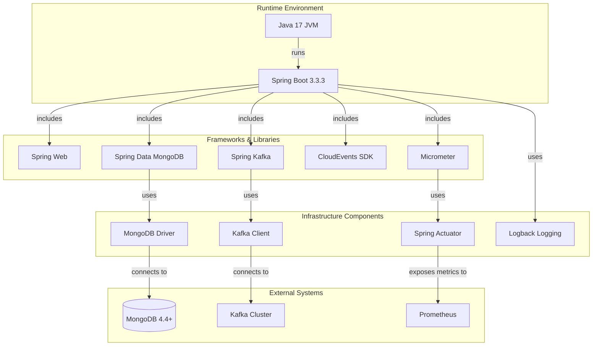
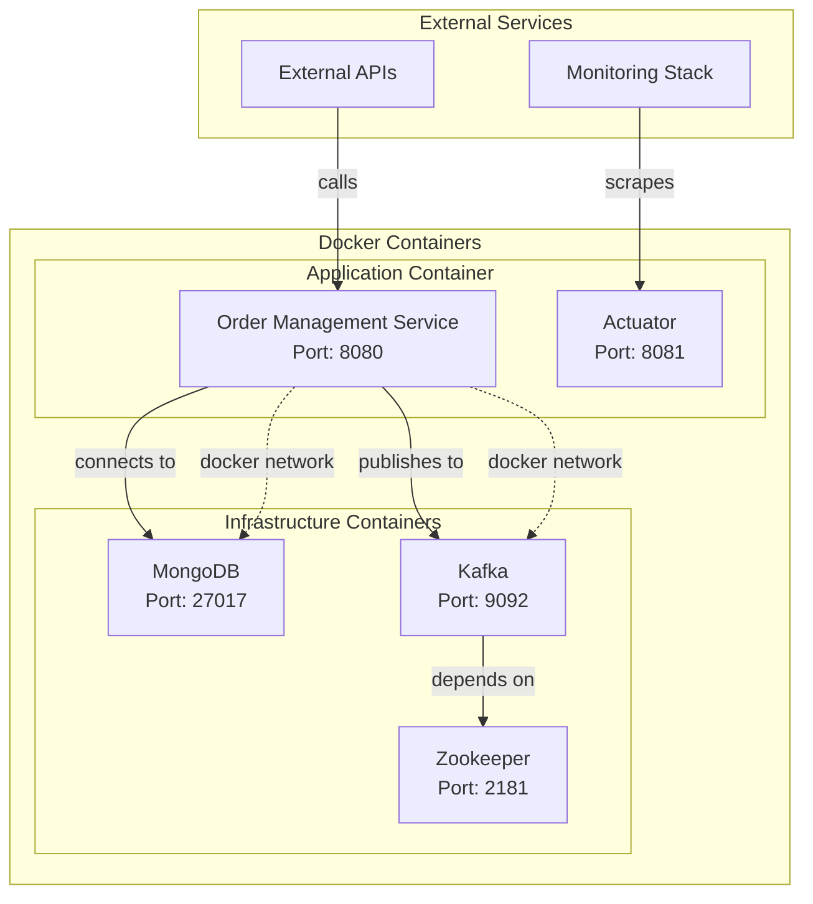
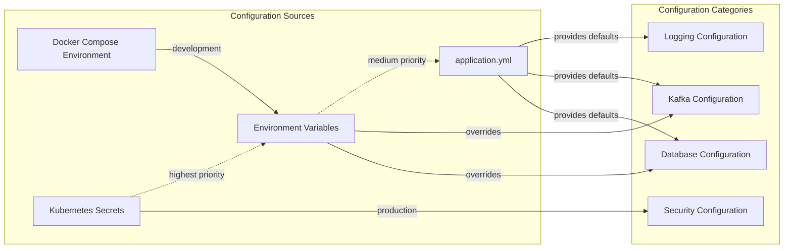

# Order Management - Overall Architecture Diagram

This diagram provides a comprehensive view of the Order Management Service architecture, showing how all components work together following Hexagonal Architecture (Ports and Adapters) pattern.

## High-Level System Architecture



## Detailed Component Architecture

```mermaid
graph TB
    subgraph "Presentation Layer"
        FC[FulfillmentOrderController]
        HEALTH[Health Check Controller]
        METRICS[Metrics Endpoint]
    end

    subgraph "Application Services"
        FOS[FulfillmentOrderService]
        EPS[EventPublisherService]
        SCHED[OutboxEventPublisherScheduler]
    end

    subgraph "Domain Model"
        subgraph "FulfillmentOrder Aggregate"
            FO[FulfillmentOrder]
            OI[OrderItem]
            ADDR[Address]
            STATUS[FulfillmentOrderStatus]
        end

        subgraph "Outbox Aggregate"
            OE[OutboxEvent]
        end

        subgraph "Domain Events"
            FOR_EVENT[FulfillmentOrderReceivedEvent]
            FOV_EVENT[FulfillmentOrderValidatedEvent]
            FOC_EVENT[FulfillmentOrderCancelledEvent]
            FOS_EVENT[FulfillmentOrderShippedEvent]
        end
    end

    subgraph "Infrastructure"
        FOR_REPO[FulfillmentOrderRepository]
        OE_REPO[OutboxEventRepository]
        MONGO_IMPL[MongoFulfillmentOrderRepository]
        KAFKA_TEMPLATE[KafkaTemplate]
    end

    subgraph "External Dependencies"
        MONGO_DB[(MongoDB)]
        KAFKA_BROKER[Kafka Cluster]
        ACTUATOR[Spring Actuator]
    end

    %% Service Dependencies
    FC -->|@Autowired| FOS
    FOS -->|@Autowired| EPS
    FOS -->|@Autowired| FOR_REPO
    EPS -->|@Autowired| OE_REPO
    EPS -->|@Autowired| KAFKA_TEMPLATE
    SCHED -->|@Autowired| EPS

    %% Domain Model Relationships
    FO -->|contains| OI
    FO -->|has| ADDR
    FO -->|has| STATUS
    FO -->|publishes| FOR_EVENT
    FO -->|publishes| FOV_EVENT
    FO -->|publishes| FOC_EVENT
    FO -->|publishes| FOS_EVENT

    %% Infrastructure Implementations
    FOR_REPO -.->|interface| MONGO_IMPL
    MONGO_IMPL -->|stores in| MONGO_DB
    KAFKA_TEMPLATE -->|publishes to| KAFKA_BROKER

    %% Event Flow
    FOR_EVENT -.->|stored as| OE
    FOV_EVENT -.->|stored as| OE
    FOC_EVENT -.->|stored as| OE
    FOS_EVENT -.->|stored as| OE

    %% Monitoring
    HEALTH -->|checks| MONGO_DB
    HEALTH -->|checks| KAFKA_BROKER
    METRICS -->|exposes| ACTUATOR
```

## Data Flow and Event Processing



## Technology Stack Mapping



## Deployment Architecture



## Configuration Management



## Quality Attributes

### Scalability
- **Horizontal Scaling**: Stateless application services
- **Database Scaling**: MongoDB replica sets and sharding
- **Event Processing**: Kafka partitioning for parallel processing

### Reliability
- **Transactional Outbox**: Ensures event delivery
- **Retry Mechanisms**: Failed event publishing retry
- **Circuit Breakers**: Protection against external service failures

### Observability
- **Metrics**: Micrometer + Prometheus
- **Logging**: Structured JSON logging
- **Tracing**: Distributed tracing with Spring Cloud Sleuth
- **Health Checks**: Spring Actuator endpoints

### Security
- **Input Validation**: DTO validation and sanitization
- **Authentication**: JWT token validation (future)
- **Authorization**: Role-based access control (future)
- **Audit Trail**: Event sourcing for complete audit log