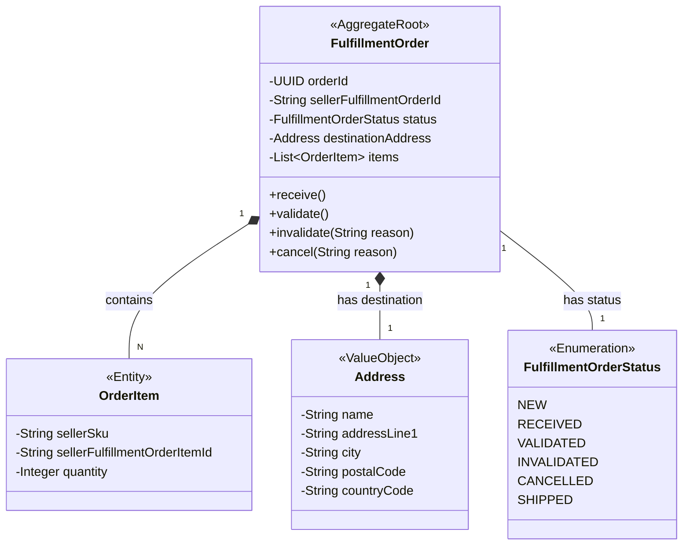

# Fulfillment Order Aggregate

This diagram illustrates the `FulfillmentOrder` aggregate, its entities, and value objects.

- **`FulfillmentOrder`**: The Aggregate Root.
- **`OrderItem`**: An Entity within the aggregate.
- **`Address`**: A Value Object.
- **`FulfillmentOrderStatus`**: An Enum Value Object representing the state of the order.

