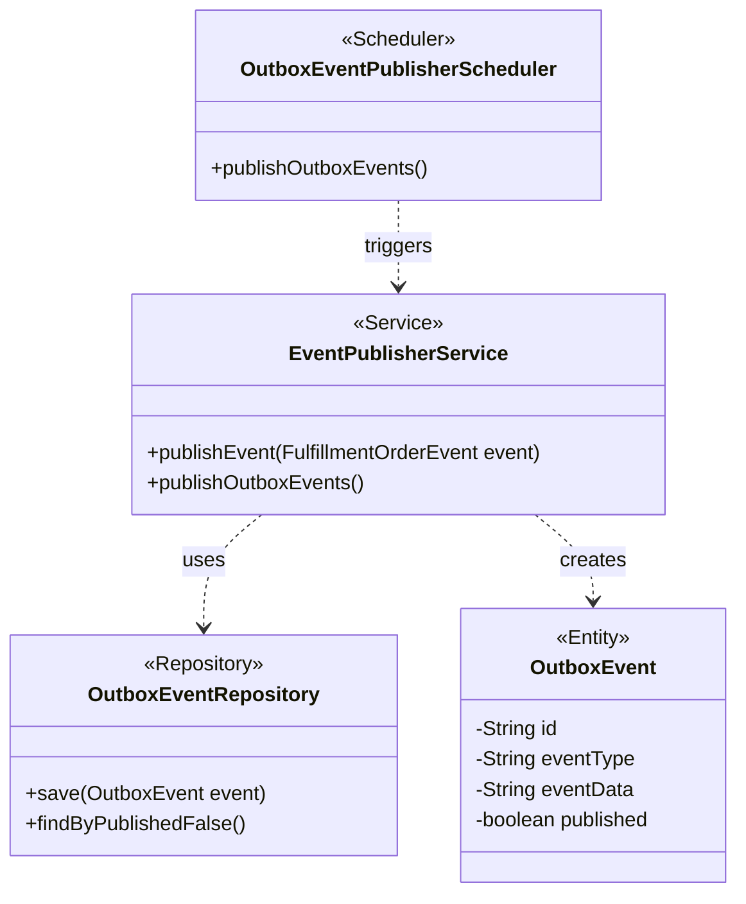

# Outbox Pattern Implementation

This diagram details the classes involved in the Outbox Pattern implementation for reliable event publishing.

- **`OutboxEventPublisherScheduler`**: A scheduled component that triggers the event publishing process.
- **`EventPublisherService`**: A service responsible for creating `OutboxEvent` entities and publishing them to a message broker (e.g., Kafka).
- **`OutboxEvent`**: An Entity representing an event to be published.
- **`OutboxEventRepository`**: The repository for storing and retrieving `OutboxEvent` entities.

