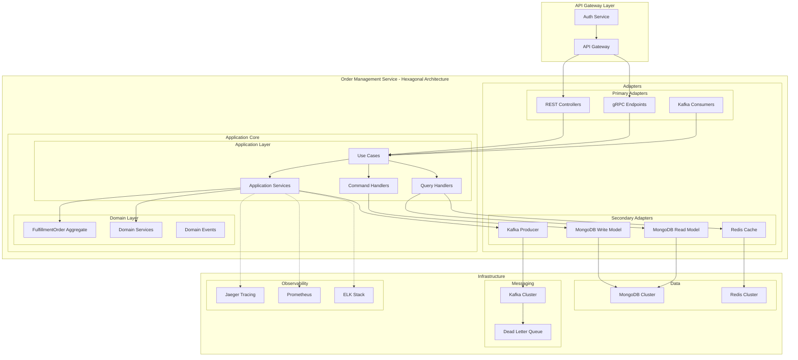

# Order Management Service - Project Assessment

## Executive Summary

This document provides a comprehensive assessment of the Order Management Service for Paklog, evaluating the implementation against Domain-Driven Design (DDD), Clean Code principles, and Distributed Architecture patterns. The service demonstrates a solid foundation with hexagonal architecture, proper domain modeling, and event-driven patterns, though there are opportunities for improvement in several areas.

**Overall Assessment Score: 7.5/10**

---

## 1. Domain-Driven Design Assessment

### 1.1 Strategic Design

#### Strengths
- **Clear Bounded Context**: The service properly defines the Order Management bounded context, focusing on the fulfillment order lifecycle
- **Domain Language**: Consistent use of domain terminology (FulfillmentOrder, OrderItem, etc.)
- **Context Mapping**: Clear integration points with external systems (E-commerce, WMS, Notification Service)

#### Areas for Improvement
- **Missing Domain Services**: Complex business logic is embedded in application services rather than domain services
- **Limited Context Map Documentation**: No explicit context map defining relationships with other bounded contexts
- **Subdomain Classification**: No clear distinction between core, supporting, and generic subdomains

### 1.2 Tactical Design - Aggregates

#### Current Implementation: FulfillmentOrder Aggregate

**Structure:**
- **Aggregate Root**: `FulfillmentOrder`
- **Entities**: `OrderItem` (though implemented more like a Value Object)
- **Value Objects**: `Address`, `FulfillmentOrderStatus`

**Aggregate Boundaries Analysis:**

✅ **Strengths:**
- Aggregate is properly sized for transactional consistency
- Single aggregate root enforces invariants
- State transitions are encapsulated within the aggregate

⚠️ **Issues:**
1. **OrderItem Identity**: Currently treated as an entity but lacks proper identity management
2. **Aggregate Size**: May grow large with many items, affecting performance
3. **Missing Invariants**: No explicit validation of business rules (e.g., minimum/maximum items)

**Recommended Aggregate Design:**
```
FulfillmentOrder Aggregate
├── Root: FulfillmentOrder
├── Entities: None (OrderItems should be Value Objects)
└── Value Objects: OrderItem, Address, FulfillmentOrderStatus
Rationale: Transaction boundaries align with order-level operations
```

### 1.3 Domain Events

#### Strengths
- Comprehensive event coverage for state transitions
- Events follow CloudEvents specification
- Clear event naming convention

#### Issues
- Events lack rich domain information (only IDs in some cases)
- Missing event versioning strategy
- No event sourcing implementation (if required for audit trail)

### 1.4 Domain Model Purity

**Score: 6/10**

**Issues Identified:**
1. **Framework Annotations in Domain**: MongoDB annotations pollute domain model
2. **Public Setters**: Violates encapsulation principles
3. **Anemic Domain Model**: Limited business logic in entities
4. **Missing Factory Pattern**: Direct constructor usage instead of domain factories

---

## 2. Clean Architecture Assessment

### 2.1 Hexagonal Architecture Implementation

**Score: 8/10**

**Layer Structure:**
```
├── Domain Layer (Core)          ✅ Properly isolated
├── Application Layer            ✅ Orchestrates use cases
├── Infrastructure Layer         ✅ Implements adapters
└── Interfaces Layer            ✅ REST controllers
```

#### Strengths
- Clear separation of concerns
- Dependency inversion properly implemented
- Ports and adapters pattern followed

#### Issues
- Infrastructure concerns leak into domain (MongoDB annotations)
- Missing explicit port interfaces for some adapters
- Application services handle both orchestration and infrastructure concerns

### 2.2 SOLID Principles Compliance

#### Single Responsibility Principle (SRP)
**Score: 7/10**
- ✅ Services have focused responsibilities
- ⚠️ `FulfillmentOrderService` handles both business logic and event publishing

#### Open/Closed Principle (OCP)
**Score: 6/10**
- ⚠️ Limited use of abstractions for extension
- ⚠️ Direct implementations instead of interfaces in some areas

#### Liskov Substitution Principle (LSP)
**Score: 8/10**
- ✅ Repository interfaces properly abstracted
- ✅ No violations identified

#### Interface Segregation Principle (ISP)
**Score: 7/10**
- ✅ Focused interfaces
- ⚠️ Could benefit from more granular command/query separation

#### Dependency Inversion Principle (DIP)
**Score: 9/10**
- ✅ Constructor injection throughout
- ✅ Domain doesn't depend on infrastructure
- ⚠️ Minor: MongoDB annotations in domain

### 2.3 Code Quality Metrics

#### Complexity Analysis
- **Cyclomatic Complexity**: Low to moderate (good)
- **Method Length**: Generally concise
- **Class Cohesion**: High

#### Testing Coverage
- Comprehensive test suite present
- Unit and integration tests implemented
- Missing: Domain-focused tests, property-based testing

---

## 3. Distributed Architecture Assessment

### 3.1 Event-Driven Architecture

**Score: 8.5/10**

#### Strengths
- **Transactional Outbox Pattern**: Ensures reliable event delivery
- **CloudEvents Specification**: Standard event format
- **Idempotency**: Proper idempotency key handling
- **Event Publishing**: Asynchronous, decoupled design

#### Areas for Improvement
1. **Missing Event Store**: No event history retention
2. **No Dead Letter Queue**: Missing error handling for failed events
3. **Limited Retry Strategy**: Basic retry without exponential backoff
4. **No Circuit Breaker**: For Kafka communication

### 3.2 Resilience Patterns

#### Implemented Patterns
- ✅ Transactional Outbox
- ✅ Idempotency
- ✅ Scheduled retry for events

#### Missing Patterns
- ❌ Circuit Breaker
- ❌ Bulkhead
- ❌ Rate Limiting
- ❌ Timeout handling
- ❌ Graceful degradation

### 3.3 Data Management

#### Current Implementation
- **Database**: MongoDB (Document store)
- **Pattern**: Shared database anti-pattern avoided
- **Consistency**: Eventual consistency via events

#### Issues
1. **No CQRS**: Read and write models not separated
2. **Missing Saga Pattern**: For distributed transactions
3. **No Event Sourcing**: If audit trail is critical

### 3.4 Observability

**Score: 7/10**

#### Strengths
- Structured logging with correlation IDs
- Prometheus metrics endpoint
- Health checks implemented
- Performance timing in logs

#### Missing
- Distributed tracing (only mentioned, not fully implemented)
- Custom business metrics
- SLA monitoring
- Error rate tracking

---

## 4. Spring Boot Best Practices Assessment

### 4.1 Dependency Injection
**Score: 10/10**
- ✅ Constructor injection exclusively used
- ✅ No field injection
- ✅ Immutable dependencies

### 4.2 Component Stereotypes
**Score: 9/10**
- ✅ Proper use of @Service, @Repository, @RestController
- ⚠️ Some services could be split into @Component for utilities

### 4.3 Configuration Management
- ✅ Environment-specific profiles
- ✅ Externalized configuration
- ⚠️ Missing @ConfigurationProperties for type-safe config

---

## 5. Security Assessment

### Identified Concerns
1. **No Authentication/Authorization**: API endpoints are unprotected
2. **Missing Input Validation**: Limited validation on DTOs
3. **No Rate Limiting**: Vulnerable to DoS attacks
4. **Sensitive Data Exposure**: Logs may contain sensitive information
5. **Missing API Versioning**: No version in URL paths

---

## 6. Performance Considerations

### Potential Bottlenecks
1. **Outbox Pattern Polling**: Every 5 seconds may not scale
2. **No Caching Layer**: All requests hit database
3. **Missing Pagination**: API returns full lists
4. **Synchronous Event Publishing**: Within transaction boundary

---

## 7. Recommendations for Improvement

### High Priority

1. **Remove Framework Dependencies from Domain**
   - Create separate persistence models
   - Use mappers between domain and persistence layers
   
2. **Implement CQRS**
   - Separate read models for queries
   - Optimize for different access patterns
   
3. **Add Authentication & Authorization**
   - Implement OAuth 2.0 / JWT
   - Add role-based access control
   
4. **Enhance Event Architecture**
   - Add event versioning
   - Implement dead letter queue
   - Add circuit breaker for Kafka

### Medium Priority

5. **Improve Domain Model**
   - Remove public setters
   - Add factory methods
   - Implement rich domain services
   
6. **Add Resilience Patterns**
   - Circuit breaker (Hystrix/Resilience4j)
   - Retry with exponential backoff
   - Bulkhead pattern for isolation
   
7. **Enhance Testing**
   - Add property-based testing
   - Implement contract testing
   - Add performance tests

### Low Priority

8. **Optimize Performance**
   - Add caching layer (Redis)
   - Implement read-through cache
   - Add database indexes
   
9. **Improve Observability**
   - Full distributed tracing
   - Custom business metrics
   - Enhanced monitoring dashboards

---

## 8. Architecture Diagram - Recommended Target State



---

## 9. Maturity Model Assessment

| Aspect | Current Level | Target Level | Gap |
|--------|--------------|--------------|-----|
| Domain Modeling | Level 2 - Basic DDD | Level 4 - Rich Domain | 2 |
| Clean Architecture | Level 3 - Good Separation | Level 4 - Pure Hexagonal | 1 |
| Event Architecture | Level 3 - Outbox Pattern | Level 4 - Event Sourcing | 1 |
| Resilience | Level 2 - Basic Patterns | Level 4 - Fully Resilient | 2 |
| Observability | Level 2 - Logging & Metrics | Level 4 - Full Observability | 2 |
| Security | Level 1 - Minimal | Level 4 - Zero Trust | 3 |
| Testing | Level 3 - Good Coverage | Level 4 - Comprehensive | 1 |
| DevOps | Level 3 - CI/CD | Level 4 - GitOps | 1 |

---

## 10. Conclusion

The Order Management Service demonstrates a solid foundation with good architectural patterns and practices. The team has made excellent choices in:
- Adopting hexagonal architecture
- Implementing the outbox pattern
- Following Spring Boot best practices
- Maintaining clean code structure

The main areas requiring attention are:
1. **Security**: Currently the weakest area
2. **Domain Model Purity**: Remove infrastructure concerns
3. **Resilience**: Add more patterns for production readiness
4. **Performance**: Implement caching and optimization

With the recommended improvements, this service can achieve production-grade quality suitable for a critical business domain.

---

## Appendix A: Quick Wins

These improvements can be implemented immediately with minimal effort:

1. **Add Input Validation**
   ```java
   @Valid @RequestBody CreateFulfillmentOrderRequest
   ```

2. **Remove Public Setters**
   - Use builder pattern or factory methods
   
3. **Add Configuration Properties**
   ```java
   @ConfigurationProperties(prefix = "app.kafka")
   ```

4. **Implement Basic Security**
   ```java
   @EnableWebSecurity
   ```

5. **Add Pagination**
   ```java
   Page<FulfillmentOrder> findAll(Pageable pageable)
   ```

---

## Appendix B: Technical Debt Register

| Item | Priority | Effort | Impact | Risk |
|------|----------|--------|--------|------|
| Remove MongoDB annotations from domain | High | Medium | High | Low |
| Add authentication | Critical | Medium | Critical | High |
| Implement CQRS | Medium | High | High | Medium |
| Add circuit breaker | High | Low | High | Low |
| Enhance event schema | Medium | Medium | Medium | Low |
| Add caching layer | Low | Medium | Medium | Low |

---

*Assessment Date: October 2025*  
*Assessor: Solution Architecture Team*  
*Next Review: January 2026*